# Gallery

A modern Android gallery app for browsing, organizing, and managing photos and videos.

The app is built around simple everyday actions - finding media, viewing it, organizing albums, managing favorites, and recovering deleted items.

**First version developed by Aman Sharma - 13 August 2026**

---

## Screenshots

<table>
  <tr>
    <td align="center">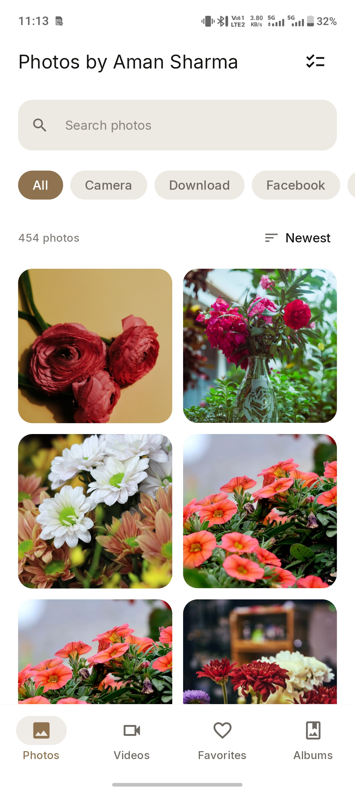</td>
    <td align="center">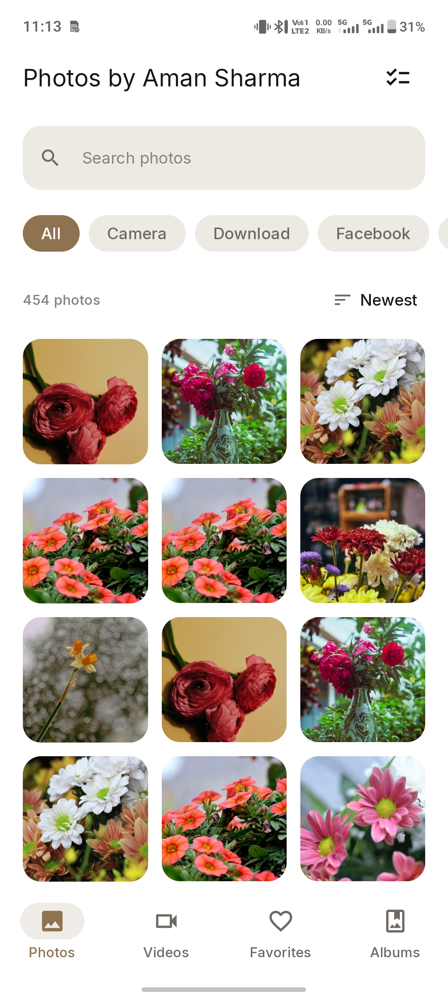</td>
    <td align="center">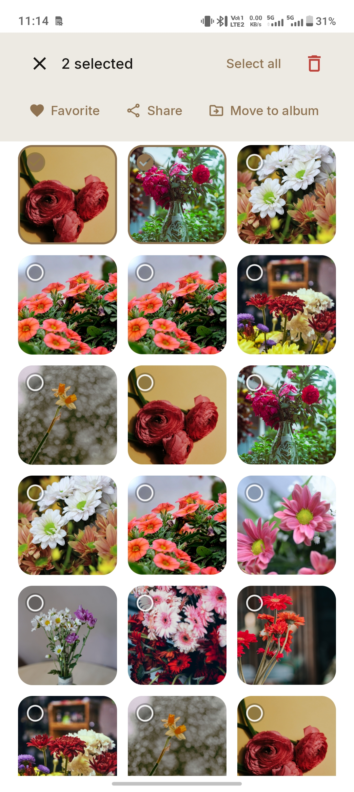</td>
  </tr>
  <tr>
    <td align="center">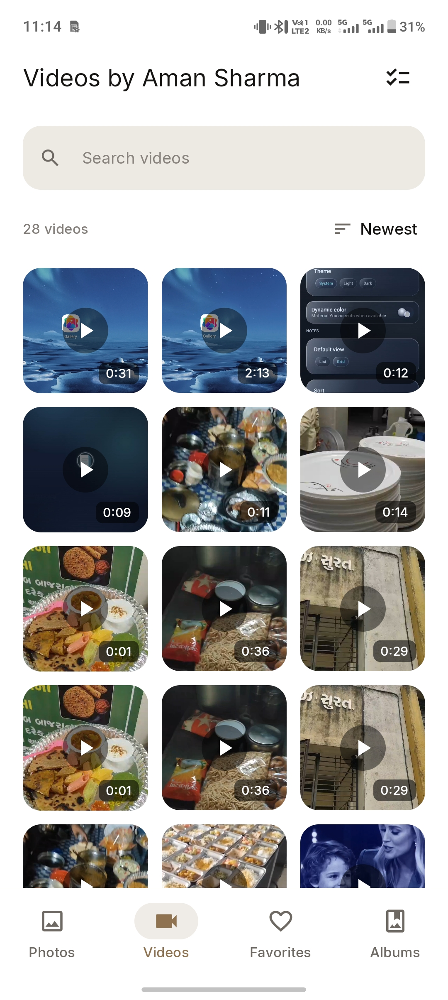</td>
    <td align="center">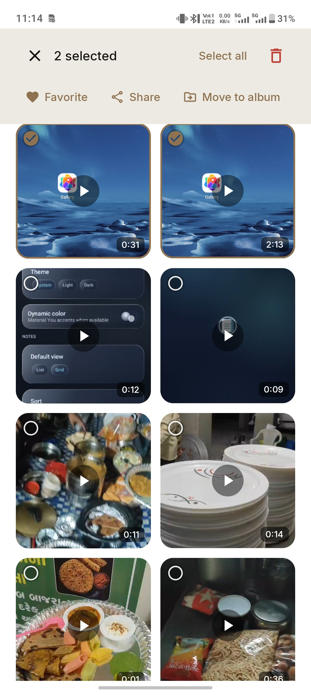</td>
    <td align="center">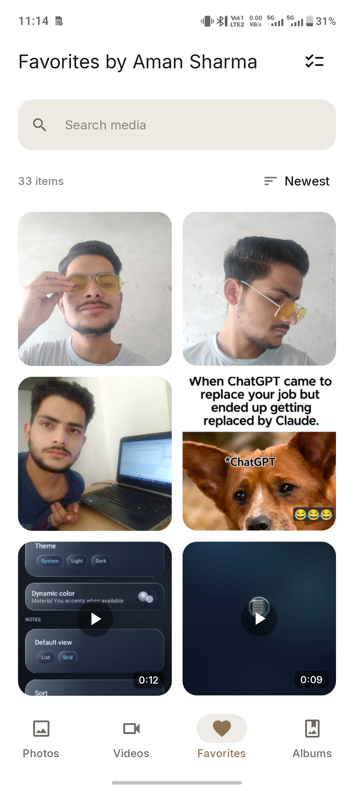</td>
  </tr>
  <tr>
    <td align="center">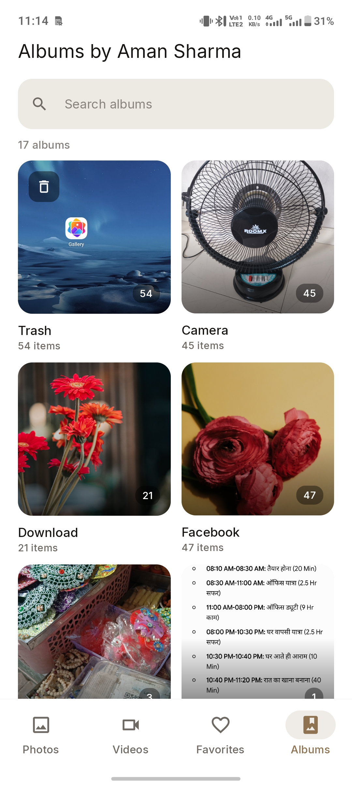</td>
    <td align="center">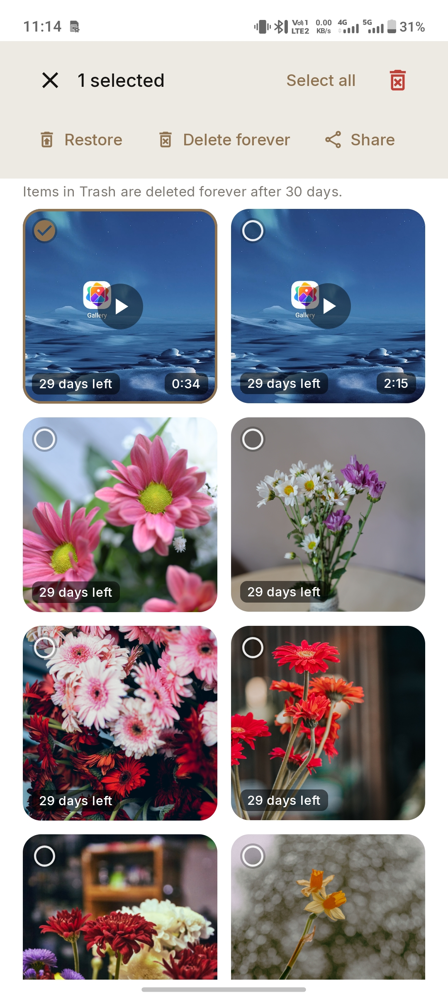</td>
    <td align="center">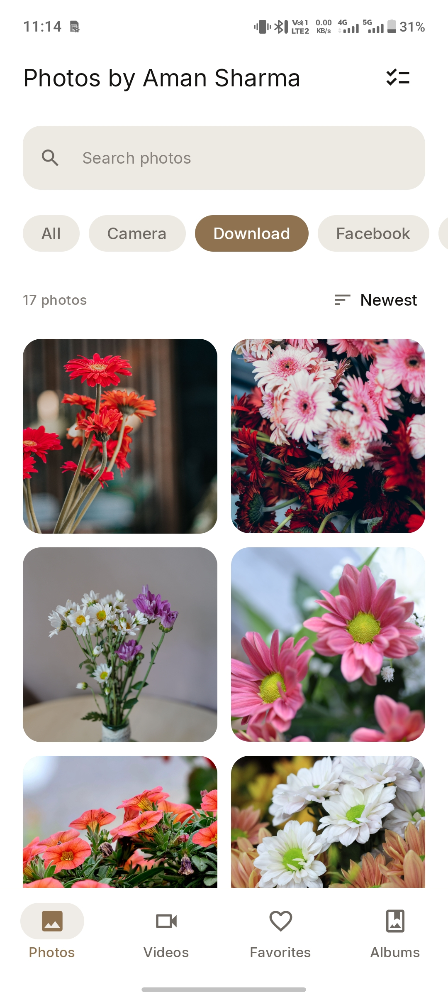</td>
  </tr>
  <tr>
    <td align="center">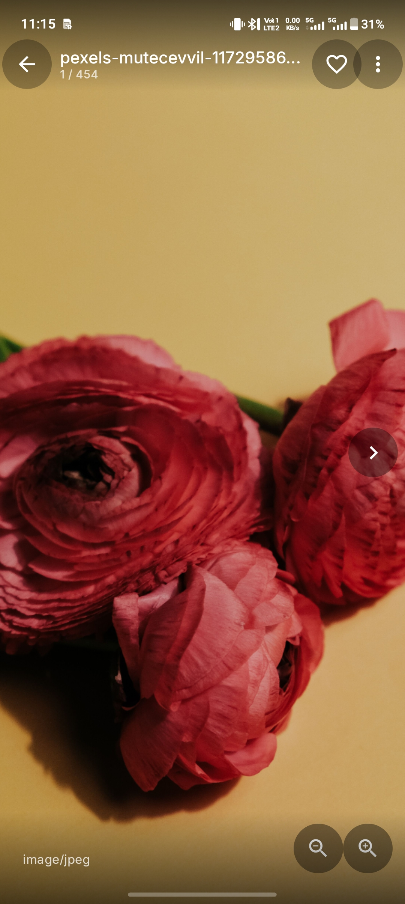</td>
    <td align="center">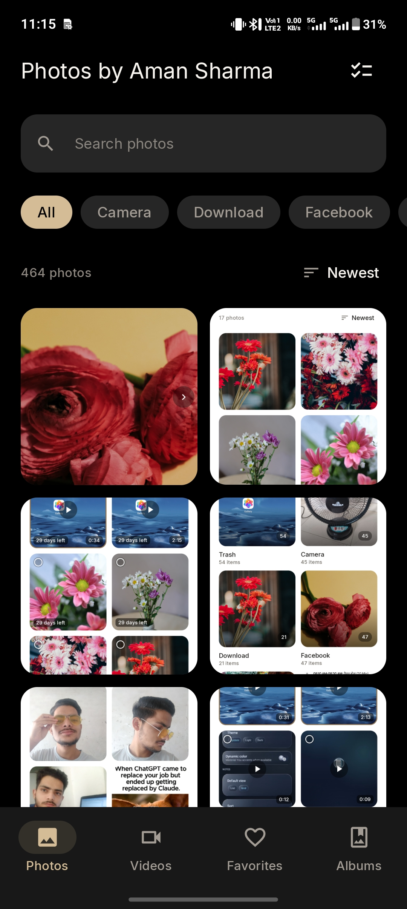</td>
    <td align="center">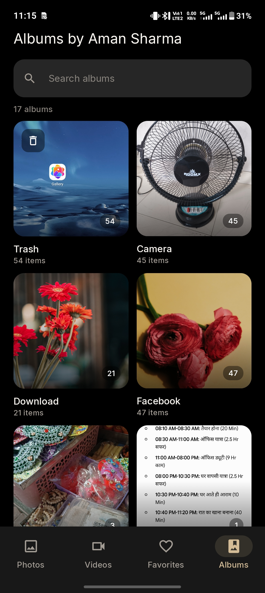</td>
  </tr>
</table>

---

## Features

### Photos

- Browse photos in a clean grid
- Search photos
- Filter photos by category
- Sort by newest
- Full-screen photo viewer
- Add photos to Favorites
- Select multiple photos
- Share photos
- Move photos to albums
- Delete photos

### Videos

- Dedicated video section
- Video thumbnails with duration
- Video playback
- Search videos
- Sort videos
- Multi-selection
- Favorite, share, and delete actions

### Favorites

A dedicated section for quickly accessing photos and videos marked as favorites.

### Albums

- Browse media by album
- Album item counts
- Album covers
- Move media between albums
- Organized media browsing

### Trash

Deleted media is moved to Trash instead of being removed immediately.

- Restore deleted media
- Delete forever
- 30-day retention period
- Remaining days shown for deleted items

### Media Selection

Multiple photos and videos can be selected together for faster management.

Available actions include:

- Favorite
- Share
- Move to album
- Delete

---

## User Experience

The app is organized into four main sections:

- Photos
- Videos
- Favorites
- Albums

The focus is on keeping common gallery actions easy to find without adding unnecessary complexity.

---

## Design

- Material-inspired Android UI
- Clean grid-based media layout
- Rounded media cards
- Light and dark themes
- System theme support
- Dynamic color support
- Consistent spacing and typography
- Responsive layouts
- Touch-friendly controls
- Simple navigation

---

## Media Management

The app covers the main workflows involved in managing a personal media library:

**Browse → Search → Select → Organize → View → Manage**

This includes filtering, sorting, favorites, sharing, album organization, trash, restoration, and permanent deletion.

---

## Technology

- Kotlin
- Android
- Jetpack Compose
- Material Design
- Android Media APIs

---

## Version

**Version 1.0**

**First version:** 13 August 2026

---

## Developer

**Aman Sharma**

Android Developer

**Kotlin · Jetpack Compose · MVVM · Modern Android UI**
